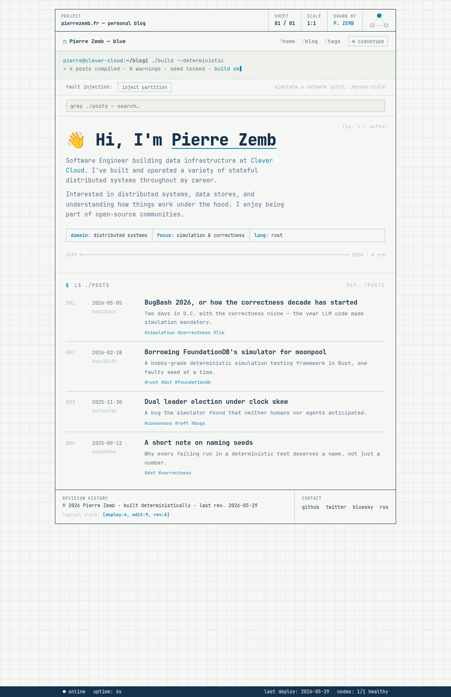

# zola-quorum-schematics

A [Zola](https://www.getzola.org) theme that looks like an **architect's drawing
sheet** but breathes like a **terminal**: a command-history nav, a page-aware quorum-read
console with a blinking cursor, and a switchable **read mode** that
lets a single-replica read expose the corruption a quorum read silently heals.
Two color themes — `blueprint` (ink on warm paper, light) and `cyanotype` (the negative:
cyan on navy, dark).

Roboto for prose, monospace (Consolas) for code and the terminal chrome. Fine `1px`
borders instead of shadows. A single accent cyan, with red reserved for failure states.
Zero CDN — the font is self-hosted.



## Features

- Two color themes with a JS toggle that **persists** (`localStorage`); first load
  defaults to `blueprint` (light) — no flash of the wrong theme.
- **Switchable read mode** (`read: quorum ⇄ read: single` button by the theme toggle, or
  click the cluster). The cluster always has one silently-faulty replica, rolled per load:
  - **quorum (R=2, default):** reads a majority. When the faulty replica is one of the two
    read, it's out-voted and **read-repaired** (`✓ … nX corrupted → read-repaired`, that node
    shown amber); otherwise `✓ … checksums match`. Content is always clean.
  - **single (R=1):** reads one replica. When it lands on the faulty one you get **corrupted
    blocks** — words scrambled with **typoglycemia** (first & last letter kept, so it stays
    readable), the node goes red, `✗ … checksum mismatch`, the badge degrades to `unverified`.
    Most pages still read fine — that gamble is the point. Re-rolls on reload; mode persists.
- **Page-aware quorum-read console**: each page echoes `./read --quorum <its path>` (or
  `--replica nX` in single mode) with real counts; the serving replica(s) are highlighted.
- **Nested table of contents** (hierarchically numbered `1`, `1.1`, `1.1.1`, up to 4
  levels deep) from `page.toc`, clickable heading anchors. Hide it per page with
  `extra.hide_table_of_contents = true`.
- Dual syntax-highlighting stylesheets (light + dark) switched with the theme.
- **SEO out of the box**: OpenGraph + Twitter cards, per-page `rel=canonical` (with an
  `extra.canonical` override for syndicated posts), `author` and `theme-color` meta, an
  SVG favicon + web manifest, and an optional Plausible analytics hook.
- **Standalone pages** (about / talks / contact …) render without article furniture — no
  date/reading-time/tags meta-row, breadcrumb is `~ / <slug>`.
- A themed **404 page**: a failed quorum read — the key isn't on any replica.
- **`mermaid` and `youtube` shortcodes** (Mermaid is vendored & lazy-loaded — no CDN,
  fetched only on pages that use it, and it re-renders on the color-theme toggle).
- RSS + Atom feeds, sitemap, tag taxonomy with its own index, optional client-side
  search (self-hosted elasticlunr), self-hosted Roboto (variable woff2) with a system
  Consolas stack for code and terminal chrome.
- Responsive: the footer cartouche folds, the nav **wraps onto its own row** (still
  reachable on phones), wide tables scroll, and the BOM stacks at narrow widths.

## Requirements

- Zola **0.19.0+** (developed and tested against 0.22.1).

## Install

From your site's root:

```bash
git submodule add https://github.com/PierreZ/zola-quorum-schematics themes/zola-quorum-schematics
# or just copy the folder into themes/
```

Then in your `config.toml`:

```toml
theme = "zola-quorum-schematics"
```

The theme expects:

- A `tags` taxonomy and feeds/search enabled (copy the snippet below).
- Your posts to live in a section at `content/posts/` (used for the console document count
  and the home/section listings).

```toml
taxonomies = [{ name = "tags", feed = true }]
generate_feeds = true
feed_filenames = ["atom.xml", "rss.xml"]
build_search_index = true

[markdown]
insert_anchor_links = "right"

[markdown.highlighting]
style = "class"            # required: emits class-based CSS so themes can switch
light_theme = "solarized-light"
dark_theme = "solarized-dark"
```

> **Note on syntax CSS:** with `style = "class"`, Zola emits `giallo-light.css` and
> `giallo-dark.css` at the site root (the filenames are fixed by Zola, regardless of the
> theme names). The theme links both and toggles the active one with the color theme.

## Configuration — every `[extra]` key

All keys are **optional**; each has a sensible default baked into the templates. Copy
what you want to override into your site's `[extra]`.

### Console strip (the terminal client)

The console is the client reading from the cluster, and the command **matches the current
page** — a read against its path. The exact line is driven client-side by the read mode (see
below); the server-rendered default is a quorum read:

| Page | Console command | Output (quorum) |
|------|-----------------|--------|
| home | `./read --quorum home` | `✓ quorum 2/3 · N documents · committed` |
| `/posts` | `./read --quorum posts` | `✓ quorum 2/3 · N documents · committed` |
| a post | `./read --quorum posts/<slug>` | `✓ quorum read R=2 · nodes nA,nB · checksums match` |
| `/tags` | `./read --quorum tags` | `✓ quorum 2/3 · N tags · committed` |
| a tag | `./read --quorum tags/<slug>` | `✓ quorum 2/3 · N documents · committed` |

The 3-node cluster schematic (0-indexed: `n0`–`n2`) is drawn in this strip; the serving
replica(s) are highlighted (see read modes).

| Key | Default | Description |
|-----|---------|-------------|
| `prompt_user` | `user@host` | Text before the `:` |
| `prompt_path` | `~/blog` | Path after the `:` |
| `read_replica` | `node-0` | No-JS fallback label for the serving replica |
| `cluster_enabled` | `true` | Show the 3-node cluster schematic in the console |
| `home_post_limit` | `5` | How many of the latest posts to list on the home page |

The `N` counts are real (from the section/taxonomy being viewed). A post's meta row shows
its date, reading time, and tags.

### Read modes (quorum R=2 ⇄ single R=1)

The cluster has one silently-faulty replica, **rolled at random on each page load**. The
`read: quorum`/`read: single` button (next to the color-theme toggle) — or **clicking the
cluster block** — switches how the page is read; the mode persists in `localStorage`.

- **quorum (R=2):** reads two replicas. If the faulty one is among them it's out-voted and
  **read-repaired** — `✓ quorum read R=2 · nodes nA,nB · nX corrupted → read-repaired`, with
  that node drawn amber; otherwise `✓ … checksums match`. The content served is always clean.
- **single (R=1):** reads one replica, with no majority to cross-check it. If that replica
  is the faulty one, you get the **real corruption**: words scrambled with typoglycemia
  across the page (hero, post list, article
  bodies — never the terminal chrome or code blocks), the node goes red, `✗ … checksum
  mismatch`. **Most reads land on a healthy
  replica and look fine** — reload to re-roll. (Honors `prefers-reduced-motion`: indicators
  still flip, text isn't scrambled.)

| Key | Default | Description |
|-----|---------|-------------|
| `read_modes` | `true` | Show the read-mode toggle + the faulty-replica/single-read reveal. `false` = a plain healthy quorum, no toggle |
| `default_read_mode` | `quorum` | Initial mode: `quorum` or `single` |
| `logo` | `config.title` | Brand text in the top-left of the nav |

### Hero (home page)

| Key | Default | Description |
|-----|---------|-------------|
| `avatar` | – | Profile image beside the hero intro (path under `static/` or an https URL). Omit to hide |
| `specs` | – | Array of `{ label, value }` cells (`domain` / `focus` / `lang` …) |
| `dimline_start` | – | Left end of the dimension line |
| `dimline_end` | – | Right end of the dimension line |

The hero `<h1>` comes from the home section's `title` (HTML is allowed — wrap a word in
`<span class="u">…</span>` for the cyan underline), and the intro paragraphs from the
section body.

```toml
specs = [
  { label = "domain", value = "distributed systems" },
  { label = "focus", value = "simulation & correctness" },
  { label = "lang", value = "rust" },
]
dimline_start = "2019"
dimline_end = "2026 · 6 yrs"
```

### Article

The post meta row shows the date, reading time, and tags.

Per-post front-matter `[extra]` keys the theme reads:

| Key | Description |
|-----|-------------|
| `canonical` | Emit a `rel=canonical` (and `og:url`) pointing elsewhere — for syndicated/cross-posted articles |
| `image` | Per-page OpenGraph/Twitter card image (overrides `extra.og_image`) |
| `hide_table_of_contents` | `true` → suppress the TOC on this page |

```toml
[extra]
hide_table_of_contents = true
```

### Standalone pages (non-posts)

Any page **outside** the `posts/` section (e.g. `about.md`, `talks.md`, `contact.md`)
renders through the same `page.html` but drops the article furniture: no
date/reading-time/tags meta-row, and the breadcrumb is `~ / <slug>` instead of
`~ / blog / <slug>`. Nothing to configure — it's detected from the page path.

### SEO, social cards & favicon

| Key | Default | Description |
|-----|---------|-------------|
| `og_image` | – | Path under `static/` (or a full `https` URL) for OpenGraph/Twitter cards when a page sets no `extra.image` |
| `theme_color` | `#15324d` | `<meta name="theme-color">` (mobile browser chrome) |
| `og_locale` | – | `<meta property="og:locale">`, e.g. `en_US` |
| `twitter.site` | – | `@handle` for `<meta name="twitter:site">` (card attribution) |
| `twitter.creator` | – | `@handle` for `<meta name="twitter:creator">` |

The theme emits `og:*` / `twitter:*` tags, `rel=canonical`, `<meta name="author">`
(from the top-level `author`), and one `article:tag` per tag on posts. It ships `static/favicon.svg` + `static/site.webmanifest`;
drop your own `favicon.ico` / `apple-touch-icon.png` / PNG set into `static/` and add the
matching `<link>`s in `templates/partials/favicon.html` for full legacy/PWA coverage.

The shipped `static/site.webmanifest` carries the theme's own `name` / `short_name`
(`zola-quorum-schematics` / `quorum`) — so an installed PWA would show that, not your
site. Static files are copied verbatim (Zola doesn't template them), so override it by
editing `static/site.webmanifest` in your own site: set `name` / `short_name` to your
title and `theme_color` to match your `[extra].theme_color`.

### Analytics (optional)

Add an `[extra.plausible]` block to inject a [Plausible](https://plausible.io) script;
omit it entirely to disable. The theme is otherwise analytics-free. Two installation
styles are supported:

```toml
# Current per-site script (Oct 2025+) — copy the snippet from your Plausible
# site settings. Loads pa-XXXXX.js and self-bootstraps via plausible.init().
[extra.plausible]
src = "https://plausible.io/js/pa-XXXXX.js"
```

```toml
# — or — the classic script, keyed by your site domain:
[extra.plausible]
domain = "example.com"
```

Set `src` for the per-site script (no `domain` needed) **or** `domain` for the classic
script. If both are set, `src` wins.

### Footer & navigation

| Key | Default | Description |
|-----|---------|-------------|
| `copyright` | `config.title` | Revision-history line |
| `nav` | home / blog / tags | Array of `{ name, url }`; use `$BASE_URL` as a prefix |
| `social` | – | Array of `{ name, url }` social links (an `rss` link is added automatically) |

```toml
[[extra.nav]]
name = "home"
url = "$BASE_URL/"
[[extra.nav]]
name = "blog"
url = "$BASE_URL/posts/"

[[extra.social]]
name = "github"
url = "https://github.com/you"
```

### Search (optional)

| Key | Default | Description |
|-----|---------|-------------|
| `[extra.search] enabled` | `false` | Show a client-side search box in the nav bar (results drop down) |

Requires `build_search_index = true`. The theme ships a vendored
`static/js/elasticlunr.min.js` (no CDN) and a minimal `search.js`.

## Shortcodes

### `quote(author, source?)`

A framed citation with a cyan left border.

```

We said "good enough" because we wrote it, we understood it, we tried it.
AI broke all three.

```

### `note(title?)`

A callout box (`title` defaults to `note`).

```

If the scheduler is deterministic, every flake becomes a fixture.

```

### `mermaid()`

A [Mermaid](https://mermaid.js.org) diagram. The library is **vendored** (no CDN) and
lazy-loaded only on pages that contain a diagram; it picks up the active color theme and
re-renders when you toggle light/dark.

```

flowchart LR
  A[seed] --> B{linearizable?}
  B -->|no| C[shrink]
  B -->|yes| D[commit]

```

### `youtube(id, title?, autoplay?, class?)`

A responsive 16:9 privacy-friendly (`youtube-nocookie`) embed.

```
{{/* youtube(id="dQw4w9WgXcQ") */}}
```

## Known limitations / choices

- **Heading numbers in prose**: the reference mock shows numbers glued to each prose
  heading. Zola renders Markdown headings without a hook to inject numbers, so the theme
  numbers the **TOC** instead (hierarchically: `1`, `1.1`, `1.1.1`) and relies on clickable
  anchors. The TOC is the source of truth for section numbering.
- **Syntax CSS filenames** are fixed by Zola (`giallo-light.css` / `giallo-dark.css`).
- **Search** is opt-in and intentionally minimal (title + excerpt, top 8 results).
- The dark theme is switched via the toggle, not via `@media` on the syntax sheets,
  so JS owns the active stylesheet.

## Development

This repo is itself a runnable Zola site (it doubles as the demo). A Nix flake provides
Zola:

```bash
nix develop -c zola serve   # http://127.0.0.1:1111
nix develop -c zola build
nix develop -c zola check
```

## License

MIT — see [LICENSE](LICENSE).
